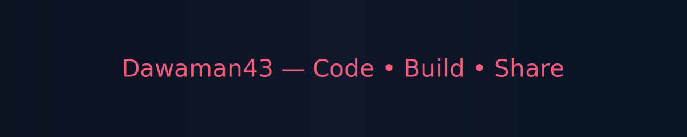

<!--
  Profile README for GitHub user: Dawaman43
  Clean, non-conversational content only. No chat transcripts included.
-->

  

  
  <h1 align="center">Hey 👋, I'm Dawit (Dawaman43)</h1>
  

  

    
    
    
    
  

  

    
    
    
  

---

## About

Developer focused on building reliable tools and web applications. Areas of interest: backend systems, automation, and open-source collaboration.

- 🔭 Currently: personal projects and open-source contributions
- 🌱 Learning: systems design, observability, and advanced testing
- 👯 Interested in collaborating on: developer tools, automation, and APIs

---

## Highlights

<table>
  <tr>
    <td align="center"></td>
    <td align="center"></td>
  </tr>
  <tr>
    <td align="center"></td>
    <td align="center"></td>
  </tr>
  <tr>
    <td colspan="2" align="center"></td>
  </tr>
  <tr>
    <td colspan="2" align="center"></td>
  </tr>
  
</table>

---

## Featured Projects

<!-- FEATURED:START - Do not edit directly, updated by scripts/update_featured_section.py -->

Placeholder — run the updater to generate featured entries.

<!-- FEATURED:END -->

## Tech & Tools

  

  

## Top Followers

<!-- FOLLOWERS:START - Do not edit directly, updated by scripts/update_followers_section.py -->

Loading top followers...

<!-- FOLLOWERS:END -->

---

## Learning

- Systems design and scalable architectures
- Observability and distributed tracing
- Advanced testing and CI/CD

---

## Contact

- Email: `dawitworkujima@gmail.com`
- LinkedIn: `https://www.linkedin.com/in/dawit-worku-jima`

---

## Visitor Count

  

---
